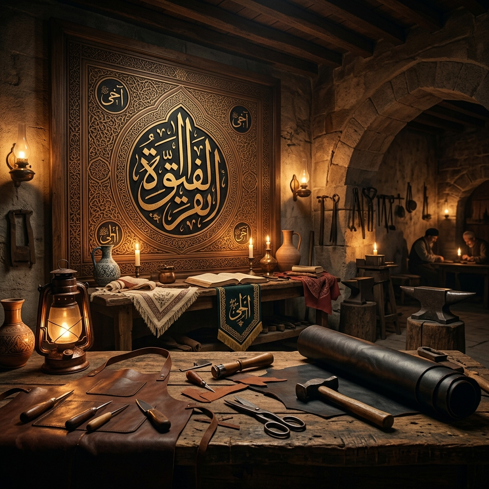

# 🏛️ Ahilik Akademisi: Ticaret Ahlakı, Ekonomi Politiği ve İş Felsefesi

**Fütüvvet Ruhu, Meslek Etiği, Sosyal Ekonomi ve Sürdürülebilir Ticaret Üzerine Kapsamlı Açık Kaynak Kılavuzu**

`ahilik-akademisi` reposuna hoş geldiniz. Bu depo, 13. yüzyıl Anadolu'sunda Ahi Evran önderliğinde kurumsallaşan ve yüzyıllar boyunca sosyo-ekonomik hayatın omurgasını oluşturan **Ahilik** felsefesini, modern dünyanın iş dinamikleriyle sentezleyerek inceleyen açık kaynaklı bir araştırma ve eğitim merkezidir.

---

## 👁️ Vizyon 2071: "Gelenekten Geleceğe İnsani Ekonomi"

Vizyonumuz, Ahilik felsefesini tarihsel bir nostalji olmaktan çıkarıp; **Yapay Zeka**, **Blokzinciri** ve **Sürdürülebilir Sanayi** çağında küresel bir iş etiği standardı haline getirmektir. İnsanın teknolojiye kul olduğu değil, teknolojinin insanın kemalatına (olgunlaşmasına) hizmet ettiği, kâr hırsının yerini "teavün" (yardımlaşma) ruhuna bıraktığı adil bir ekonomik nizam hayal ediyoruz.

---

## 📜 Ahiliğin Kökleri: Fütüvvetname ve İnsan İnşası

Ahilik, köklerini İslam'ın "Fütüvvet" (gençlik, yiğitlik, diğerkâmlık, cömertlik) anlayından alır ve bu felsefeyi Türk-İslam senteziyle pratik bir sosyo-ekonomik modele dönüştürür. 

Sistemin anayasası niteliğindeki **Fütüvvetnameler**, bir esnafın sadece nasıl ticaret yapacağını değil; nasıl oturup kalkacağını, komşusuyla nasıl konuşacağını, yoksula nasıl davranacağını belirleyen kapsamlı ahlak ve görgü kuralları bütünüdür. Ahilik felsefesi, **Homo Economicus** (sadece kendi çıkarını maksimize etmeye çalışan bencil insan) modelini reddeder; yerine **Homo Islamicus/Ahi** (kendi kazanırken toplumun da kazanmasını, adaleti ve dengeyi gözeten insan) modelini inşa eder. 

### Fütüvvetnameden 7 Temel İlke:
1.  **Elini Açık Tut:** Cömertlik ve paylaşım.
2.  **Sofranı Açık Tut:** Misafirperverlik.
3.  **Kapını Açık Tut:** Yardımseverlik.
4.  **Gözünü Bağla:** Başkalarının ayıbını görme.
5.  **Dilini Bağla:** Kötü söz söyleme, gıybet etme.
6.  **Belini Bağla:** Nefsine hakim ol.
7.  **Haramdan Uzak Dur:** Emeğinle kazan.

---

## ⚖️ Ahiliğin Sosyo-Ekonomik Mimarisi (Pazar Regülasyonları)

Ahilik, serbest piyasanın vahşileşmesini ve tekelleşmeyi önlemek için kusursuz çalışan otokontrol mekanizmaları kurmuştur:

### 1. Gedik Sistemi (Pazar Doygunluğu ve İstihdam Kontrolü)
Gedik, bir bölgede belirli bir mesleği icra etme yetkisi ve kotalandırılmasıdır. Bir şehirde kaç fırın, kaç demirci olacağı, o şehrin nüfusuna ve ihtiyacına göre belirlenir. Amaç, gereksiz rekabetle esnafın birbirini iflasa sürüklemesini engellemek ve kaliteyi düşürecek fiyat savaşlarının önüne geçmektir. Yeni bir dükkan açılabilmesi için, nüfusun artması veya bir ustanın vefat etmesi (gediğin boşalması) gerekir.

### 2. Narh Sistemi (Fiyat ve Enflasyon Kontrolü)
Ahilikte malın fiyatı, serbest piyasanın acımasız dalgalanmalarına terk edilmez. Hammadde maliyeti, ustanın emeği ve makul bir kâr payı (genellikle %10-15 civarı) hesaplanarak malın satılabileceği tavan fiyat (Narh) belirlenir. Bu, hem üreticiyi zarardan hem de tüketiciyi fahiş fiyattan (karaborsacılıktan) koruyan mükemmel bir dengedir.

### 3. Orta Sandığı (Teavün / Yardımlaşma Fonu)
Modern kredi kooperatiflerinin ve işsizlik sigortasının atasıdır. Her esnaf, kazancının bir kısmını (genellikle binde birini) Orta Sandığı'na bağışlar. Bu fonda biriken para;
* Dükkanı yanan veya batan esnafa faizsiz veya hibe olarak verilir.
* Hammadde alımında sıkıntı çekenlere destek olunur.
* Vefat eden esnafın ailesine bakılır.
* Çıraklıktan kalfalığa geçen gençlere dükkan açma sermayesi sağlanır.

---

## 👩‍🏭 Dünyanın İlk Kadın Kooperatifi: Bacıyan-ı Rum

Ahilik sadece erkek egemen bir yapı değildir. Ahi Evran'ın eşi **Fatma Bacı** tarafından kurulan **Bacıyan-ı Rum** (Anadolu Bacıları), dünyanın bilinen en eski kadın teşkilatlanmasıdır. 
Kadınlar dokumacılık, çadır yapımı, keçecilik gibi alanlarda üretime katılmış, hem ekonomik bağımsızlıklarını kazanmış hem de ordunun ve toplumun ihtiyaçlarını karşılamışlardır. Bu yapı, kadının ticaretteki yerinin yüzyıllar öncesinden ne kadar sağlam temellere oturtulduğunun en büyük kanıtıdır.

---

## 🎓 Hiyerarşi, Eğitim ve Şed Kuşanma Ritüeli

Ahilikte mesleki eğitim, katı ve sabır gerektiren bir süreçtir. "İnsan inşası" şu aşamalardan geçer:

1.  **Yamak (Hazırlık):** Genellikle 10 yaşlarında başlar. Ustasına saygıyı, dükkan adabını ve temizliği öğrenir. Karakter testinden geçer.
2.  **Çırak:** Mesleğin inceliklerini öğrenmeye başlar. Sözleşmeli bir eğitim sürecidir.
3.  **Kalfa:** Artık kendi başına iş yapabilecek yetkinliktedir, ancak ustasının gözetimindedir.
4.  **Usta ve Şed Kuşanma:** Ahlaki ve mesleki olgunluğa (kemalata) erişen kalfa, Ahi heyeti huzurunda sınava tabi tutulur. Başarılı olursa, dualar eşliğinde kendisine "Şed" (Kuşak) bağlanır.
5.  **Pabucun Dama Atılması:** Kalitesiz üretim yapan ustanın pabucu dükkanın damına atılarak meslekten men edilirdi. Bu, tarihin ilk "Kalite Güvence" sistemidir.

---

## 📂 Araştırma ve Eğitim Klasör Mimarisi

Bu akademi, bilgiyi yedi temel katmanda sınıflandırmaktadır:

- [**01- Felsefe ve Kökler**](01-felsefe-ve-kokenler/): Tasavvufi kökenler, Fütüvvetnameler ve insan inşası.
- [**02- Ekonomi Politiği**](02-ekonomi-politigi/): Gedik sistemi, Narh (fiyat kontrolü) ve Orta Sandığı (mikrofinans).
- [**03- Teşkilat Yapısı ve Sosyoloji**](03-teskilat-yapisi-ve-sosyoloji/): Bacıyan-ı Rum (kadın teşkilatı), eğitim hiyerarşisi ve ritüeller.
- [**04- Modern İş Dünyasına Uyarlamalar**](04-modern-is-dunyasina-uyarlamalar/): ESG kriterleri, ISO/TSE kalite yönetimi ve CSR.
- [**05- Tarihi Kaynaklar ve Menkibeler**](05-tarihi-kaynaklar-ve-menkibeler/): Kurucuların biyografileri ve ibretlik hikayeler.
- [**06- Gelecek Vizyonu ve Projeksiyonlar**](06-gelecek-vizyonu-ve-projeksiyonlar/): Dijital Ahilik, AI etiği ve Blokzinciri entegrasyonu.
- [**07- Vaka Analizleri ve Uygulamalar**](07-vaka-analizleri-ve-uygulamalar/): Modern kooperatifçilik ve dijital dönüşüm stratejileri.

---

## 🕯️ Manifestolar ve Evrensel Prensipler

Ahilik sisteminin çalışma ahlakı, yüzyıllar boyunca esnafın duvarlarını süsleyen şu değişmez kaidelerle yaşatılmıştır:

* *"Harama bakma, haram yeme, haram içme."*
* *"Doğru, sabırlı, dayanıklı ol. Yalan söyleme."*
* *"Büyüklerinden önce söze başlama. Kimseyi kandırma."*
* *"Kanaatkâr ol. Dünya malına tamah etme."*
* *"İşini sev, işini iyi yap, ölçü ve tartıda adil ol."*
* *"Kuvvetliyken affetmesini, hiddetliyken yumuşamasını bil."*

---

## 🚀 Ahilik Akademisi Yol Haritası (Roadmap)

### Faz 1: Temel İnşası (Tamamlandı)
- [x] Temel literatür taraması ve felsefi altyapının dökümante edilmesi.
- [x] Modern iş dünyası kavramlarıyla (ESG, CSR) kavramsal eşleştirme.

### Faz 2: Stratejik Genişleme (Şu An)
- [ ] **Dijital Ahilik Protokolü**: Akıllı sözleşmelerle yönetilen bir "Dijital Orta Sandığı" teknik mimarisinin tasarlanması.
- [ ] **Ahi Etik Sertifikasyonu**: Girişimler ve şirketler için bir "Ahilik Standartları" rehberi oluşturulması.

### Faz 3: Topluluk ve Eğitim
- [ ] Interaktif "Ahi Mentorluk" ağının kurulması.
- [ ] Üniversiteler ve STK'lar ile ortak vaka analizi çalışmaları.

---

## 💡 Startup ve Şirketler İçin Hızlı Uygulama Rehberi

Şirketinize bugün Ahi ruhu katmak için 3 basit adım:
1. **Şeffaf Narh**: Fiyat politikanızı müşterilerinize maliyet ve kâr oranlarıyla dürüstçe açıklayın.
2. **Dijital Orta Sandığı**: Çalışanlarınızın zor günleri (sağlık, eğitim vb.) için şirket içi bir yardımlaşma havuzu oluşturun.
3. **Usta-Çırak Mentorluğu**: Kıdemli çalışanlarınızın, genç yeteneklere sadece teknik değil, etik liderlik yapmasını teşvik edin.

---

## 🏛️ Ahilik Akademisi Müfredatı ve Derinleşme

Ahilik yalnıza bir esnaf teşkilatı değil, bir "Hayat Okulu"dur. Akademimizde şu alanlarda derinlemesine çalışmalar yürütülmektedir:

### 1. Mikrofinans ve Faizsiz Dayanışma
Geleneksel Orta Sandığı modelinin modern "Fintech" araçlarıyla nasıl desentralize edilebileceği üzerine modeller geliştiriyoruz.

### 2. Kalite Yönetimi (TSE-ISO Öncesi Standartlar)
Tarihsel "Pabucun Dama Atılması" uygulamasının, bugünün "User Reviews" ve "Brand Reputation" algoritmalarına nasıl temel teşkil edebileceğini araştırıyoruz.

### 3. Sosyal Sorumluluk ve Teavün
Şirketlerin kâr maksimizasyonu yerine "toplumsal refah maksimizasyonu" odaklı bir yapıya nasıl dönüşebileceği üzerine stratejiler üretiyoruz.

---

## 🛠️ Ahi Evran ve 32 Çeşit Sanat

Ahi Evran, Anadolu'ya geldiğinde dağınık halde bulunan esnaf ve sanatkârları 32 farklı branşta örgütlemiştir. Bu örgütlenme, Osmanlı'nın kuruluşundaki ekonomik gücün temelini oluşturmuştur. Başlıca branşlar:
*   **Debbağlık (Tabaklık):** Deri işleme sanatı. Ahi Evran'ın bizzat kendi mesleğidir.
*   **Sarraçlık:** Deriden eyer ve koşum takımı yapımı.
*   **Demircilik ve Bakırcılık:** Ordu için silah ve mutfak gereçleri üretimi.
*   **Dokumacılık:** Anadolu kilim ve kumaşlarının markalaşması.
*   **Dülgerlik ve Marangozluk:** Şehirlerin imarı.

Bu 32 branşın her birinin kendi piri, kendi fütüvvetnamesi ve kendi etik kuralları vardı. Bu, tarihin ilk "Meslek Odaları Birliği"dir.

---

## 🍽️ Ahi Sofrası: Paylaşım ve Sofra Adabı

Ahilikte yemek yemek sadece biyolojik bir ihtiyaç değil, bir "kardeşlik ve tevazu" eğitimidir. Ahi sofrasının (Somat) bazı değişmez kuralları vardır:
*   **Ekmek Çiğnememek:** Nimetin kırıntısına bile saygı duymak.
*   **Sofrada Eşitlik:** Usta ile çırak aynı sofraya oturur, aynı yemeği kaşıklar. Bu, sınıfsal ayrımı ortadan kaldırır.
*   **Tuz Hakkı:** Birinin tuzunu ekmeğini yemek, ona ömür boyu sadakat göstermeyi gerektirir.
*   **Kapıyı Açık Tutmak:** Sofraya gelen yabancı veya yolcu, sorgusuz sualsiz baş köşeye oturtulur.

---

## 🏰 Osmanlı'nın Kuruluşunda Ahilik (Şeyh Edebali ve Osman Gazi)

Osmanlı İmparatorluğu'nun bir aşiretten devlete dönüşmesindeki en büyük güç, Ahilerdir. Osman Gazi'nin kayınpederi **Şeyh Edebali**, bir Ahi şeyhidir.
*   **Askeri Güç:** "Alperen" ruhuyla Ahiler, gerektiğinde sınır boylarında savaşmış, gerektiğinde şehirlerin savunmasını üstlenmişlerdir.
*   **Siyasi İstikrar:** Ahiler, fethedilen bölgelerde adaleti ve ekonomik düzeni sağlayarak halkın devlete olan bağlılığını pekiştirmişlerdir.
*   **Lojistik Destek:** Ordunun silah, kıyafet ve gıda ihtiyacı Ahi loncaları tarafından "kalite ve uygun fiyat" garantisiyle karşılanmıştır.

---

## 🤝 Katkıda Bulunmak

Ahilik felsefesi paylaştıkça çoğalan bir hazinedir. Akademik makaleler, modern vaka analizleri veya teknik projeksiyonlarınızla depoya katkı sağlayabilirsiniz. 

1. Repoyu çatallayın (Fork).
2. Yeni bir çalışma dalı (branch) oluşturun: `git checkout -b narh-sistemi-analizi`
3. İçeriğinizi kaynakça göstererek, akademik ve profesyonel bir dille ekleyin.
4. Değişikliklerinizi commit edin ve Pull Request açın.

---

## 📄 Lisans

Bu akademi içeriği ve araştırmalar **MIT Lisansı** ile açık kaynak olarak sunulmaktadır. Ticaretin sadece bir hesap cüzdanı değil, bir karakter imtihanı olduğuna inanan herkes bu bilgileri özgürce kullanabilir ve geliştirebilir.